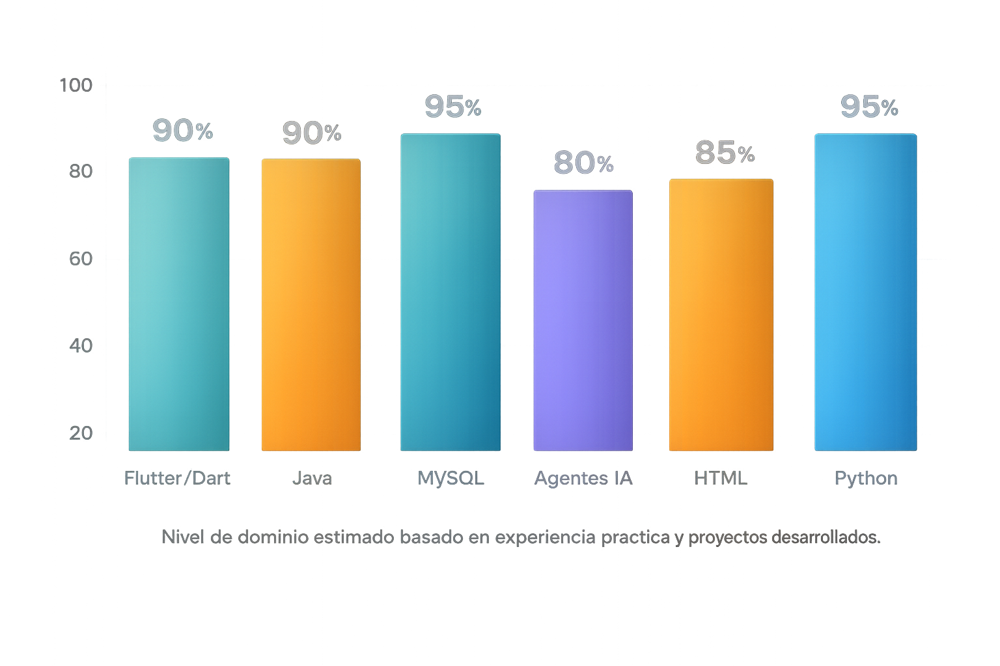

<!-- ===================== -->
<!--   HEADER CON BANNER   -->
<!-- ===================== -->

  <h1 style="
    color: #ffffff;
    font-size: 36px;
    margin-bottom: 10px;
  ">
    👋 Hola, soy Juan Diego Cadena
  </h1>

  

    🎓 Ingeniería en Computación (USFQ) · 💻 IA · Datos · Software · Flutter
  

  

    
    
    
  

---

## 🧠 Sobre mí
Soy estudiante de **Ingeniería en Computación** en la Universidad San Francisco de Quito (USFQ).  
Me enfoco en desarrollar soluciones que integren **programación, análisis de datos e inteligencia artificial**, cuidando tanto la **arquitectura del software** como la **experiencia del usuario**.

Me caracterizo por construir proyectos funcionales, bien estructurados y documentados, priorizando código claro, escalable y mantenible. Disfruto trabajar en aplicaciones reales que van desde sistemas de análisis hasta aplicaciones móviles.

---

## 🚀 Áreas de interés
- 🤖 Inteligencia Artificial aplicada y Machine Learning  
- 📊 Análisis y automatización de datos  
- 🧠 Sistemas inteligentes y agentes  
- 📱 Desarrollo de aplicaciones móviles  
- ⚙️ Arquitectura de software y estructuras de datos  

---

## 🧰 Tecnologías y herramientas
**Lenguajes**
- Python  
- Java  
- Dart  

**Frameworks y entornos**
- Flutter  
- JavaFX  

**Herramientas**
- Git & GitHub  
- APIs REST  
- SQL / MySQL  
- Docker (nivel básico)  

---

## 📊 Dominio técnico

  

  <i>Nivel de dominio estimado con base en experiencia práctica y proyectos desarrollados.</i>

---

## ⭐ Proyectos destacados

### 🏦 Bank_AI
Sistema de análisis financiero asistido por inteligencia artificial, enfocado en la toma de decisiones y automatización de procesos.

### 🐉 Dragon Nutrition
Aplicación móvil desarrollada en Flutter para el seguimiento nutricional, organización de alimentos y análisis de hábitos.

### 🍳 Recipe Buddy
Aplicación basada en inteligencia artificial para la generación de recetas, combinando lógica de negocio y experiencia de usuario.

### 🧾 Sistema Nutricional
Sistema desarrollado en Java con enfoque en arquitectura por capas, manejo de entidades, controladores y persistencia de datos.

---

## 📈 Filosofía de trabajo
- Código claro y mantenible  
- Enfoque práctico y aplicado  
- Aprendizaje continuo  
- Mejora constante a través de la iteración  

Busco seguir creciendo como desarrollador y participar en proyectos donde la tecnología tenga un impacto real.

---

## 📫 Contacto
📧 **Email:** juandicadenaz@gmail.com  
💼 **LinkedIn:** https://www.linkedin.com/in/juan-diego-cadena-2983bb383  

  <i>Gracias por visitar mi perfil. Si algún proyecto te interesa, no dudes en contactarme 🤝</i>

